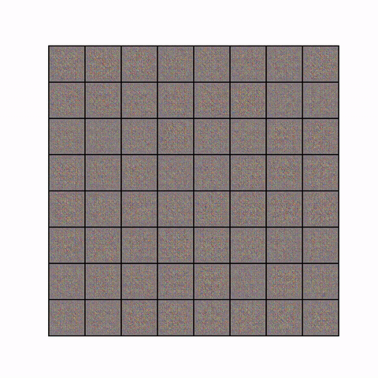

#AnimeGen<br>
Anime Face Genration with the help of dcgan
```
usage: train.py [-h] -r DATAROOT -n NEPOCHS [--lr [LR]] -sv SAVEMOD
                [--beta [BETA]] [--bs [BS]] [--ngpu [NGPU]]
                [--workers [WORKERS]] [--anm [ANM]]

optional arguments:
  -h, --help            show this help message and exit
  -r DATAROOT, --dataroot DATAROOT
                        root image directory
  -n NEPOCHS, --nepochs NEPOCHS
                        no of epochs to run
  --lr [LR]             learning rate
  -sv SAVEMOD, --savemod SAVEMOD
                        directory to save model
  --beta [BETA]         beta hyperparam for adam opt
  --bs [BS]             batch size default 128
  --ngpu [NGPU]         no of GPU
  --workers [WORKERS]   no of workers to load more workers==more memory
                        usage==faster data loading
  --anm [ANM]           should create animatopn
  
```
<br><br>
<b>Training Process</b><br><br>

